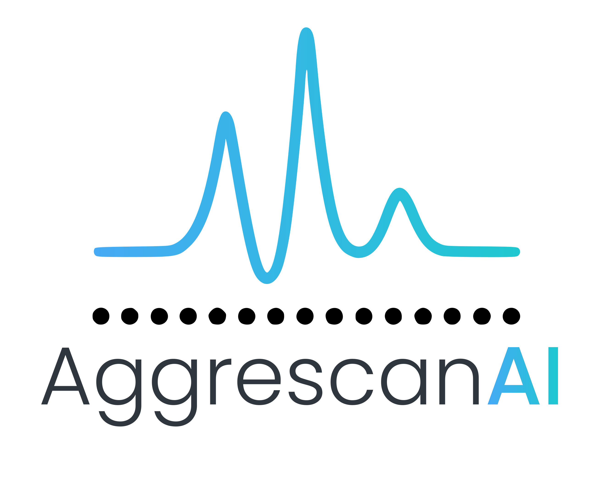

# AggrescanAI  
**Prediction of Aggregation Prone Regions (APRs) in proteins using contextual embeddings.**

[](https://colab.research.google.com/github/alvaro-2/aggrescanai/blob/main/aggrescanai.ipynb) 🡄 To launch AggrescanAI press this button.  

<p align="center">
    
</p>  


## Overview
Protein aggregation plays a dual role in biology and biotechnology. On one hand, it is a **central mechanism in neurodegenerative diseases** such as Alzheimer’s, Parkinson’s and ALS; on the other, it represents a **major bottleneck in protein engineering**, affecting solubility, stability and yield.  
APR identification is therefore key for both **understanding disease mechanisms** and **optimizing protein design**.  

**AggrescanAI** is a deep learning–based tool for residue-level prediction of aggregation-prone regions (APRs) directly from protein sequences.  
It leverages **contextualized embeddings** from the **ProtT5 protein language model**, capturing biochemical and structural information implicitly encoded in sequence data — without requiring 3D structural input.  

---


## Key Features

- Predicts **residue-level aggregation propensity** directly from sequence.  
- **No structural data required**, applicable to folded and disordered proteins.  
- Employs **ProtT5 embeddings (1024-dimensional)** to capture sequence context.   
- **Homology-augmented datasets** to enhance generalization.  
- **Validated against experimental benchmarks**.  
- Detects **aggregation shifts caused by pathogenic mutations**.  
- Fully open and **accessible via Google Colab**, no installation required.

---


## Methodology

### Workflow Summary

1. **Input**: Protein sequence in FASTA format.  
2. **Embedding generation**: Each residue is encoded as a 1024-dimensional vector using *ProtT5 pretrained model*.  
3. **Prediction**: A deep neural network classifies each residue as *aggregation-prone (APR⁺)* or *non-aggregation-prone (APR⁻)*.  
4. **Output**: Residue-level aggregation probability profile.  


---

## Usage

You can run AggrescanAI directly from Google Colab:

```bash
1. Open the Colab notebook:
   https://colab.research.google.com/github/alvaro-2/aggrescanai/blob/main/aggrescanai.ipynb

2. Enter an UniProt ID or paste your protein sequence.

3. Run all cells.

4. Visualize and download the residue-level aggregation profile (table and figure).
